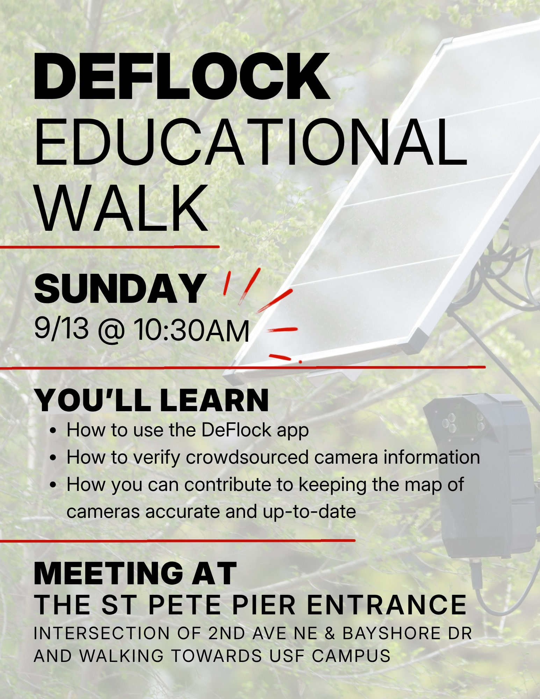

Join us tomorrow morning for a tour of several local Flock cameras! We'll be using the
[deflock app](https://deflock.org/app) to verify the location of cameras and update any missing or
incorrect information. This will give us all an opportunity to learn how to use the app, which is how
we can keep track of the cameras in our city. This will also be a time to socialize and brainstorm!

We will be meeting at the Pier and walking south towards USF St Pete. We will provide some basic
refreshments, but be prepared for walking in warm weather.

